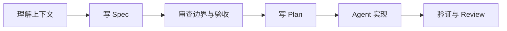

  

    
AI Coding Practice

    <h1 class="hero-title">我的 AI Coding 时间Harness Engineering</h1>
    
当 AI coding 从个人技巧走向工程实践，工程师真正要设计的不是一句 prompt，而是一个能让 Agent 稳定工作的执行系统。

  

  

    
HAR NESS

  

Harness Engineering / 2026

<!--
开场先把主题立住：这不是工具评测，也不是 prompt 技巧分享，而是工程实践视角下如何搭建 Agent 的执行环境。
-->

---

Core Shift

# 工作对象正在变化

  

    
传统工程

    

      
人类写代码

->

机器执行代码

    

  

  

    
AI coding 初期

    

      
人类写 prompt

->

AI 生成代码

->

人类修代码

    

  

  

    
Harness Engineering

    

      
人类设计约束、上下文、工具和反馈回路

->

Agent 写代码

->

机器验证代码

    

  

工程师不是退出工程，而是把工程判断编码进系统。

<!--
这一页讲三条链路的变化。重点不是 AI 替代工程师，而是工程师把工作重心上移。
-->

---

Why It Matters

# 只靠 prompt 很快会撞到上限

  

    <strong>不稳定</strong>
    
同样的 prompt，今天好用，明天可能不好用。

  

  

    <strong>不守系统约束</strong>
    
AI 能写局部代码，也容易破坏架构边界。

  

  

    <strong>没有沉淀</strong>
    
需求、设计、测试、review 每次都要从头讲。

  

  

    <strong>看不到环境</strong>
    
没有日志、数据库、CI、监控和历史决策，Agent 只能猜。

  

  

    <strong>缺少闭环</strong>
    
不能运行验证，就不能可靠地自我修正。

  

<!--
这里用“上限”引出 harness。Prompt 能提升一次输出，但不能稳定保障工程交付。
-->

---

Capability Ladder

# AI Coding 的 6 个层级

  

<strong>L0</strong>Manual Development
<small>人类完成全部工程动作</small>

  

<strong>L1</strong>Chat-Based Assistance
<small>问答、解释、片段生成</small>

  

<strong>L2</strong>Line-by-Line Review
<small>Agent 改代码，人盯每一步</small>

  

<strong>L3</strong>Plan-First, PR-Only Review
<small>先 plan，再独立实现</small>

  

<strong>L4</strong>Idea to PR
<small>从目标到调研、实现、测试、PR</small>

  

<strong>L5</strong>Parallel Cloud Execution
<small>多个 Agent 并行工作</small>

<!--
可以提到 Every 的 Compound Engineering 框架。这里用简化版本，后续重点放在 L3 之后为什么需要 harness。
-->

---

Inflection Point

# 关键变化发生在 L3

  

    <h2>L2：盯生成过程</h2>
    <ul class="compact-list">
      <li>逐步批准 Agent 动作</li>
      <li>逐行 review diff</li>
      <li>人类注意力仍是主瓶颈</li>
      <li>AI 更像加速版助手</li>
    </ul>
  

  

    <h2>L3：审工程结果</h2>
    <ul class="compact-list">
      <li>先共同形成 plan</li>
      <li>Agent 独立实现</li>
      <li>人类 review PR 和风险</li>
      <li>AI 变成可委托执行者</li>
    </ul>
  

从这一层开始，AI coding 不再是“让 AI 写代码”，而是“让 AI 按可审查的计划完成工程任务”。

---

Tools

# 工具是 Harness 的入口，不是终点

  
<strong>Cursor</strong>
IDE 原生体验，适合从编辑器工作流平滑过渡。

  
<strong>Claude Code</strong>
强调 agentic loop，能读项目、调工具、跑命令。

  
<strong>Codex</strong>
从 ChatGPT、CLI、云端任务进入工程场景。

  
<strong>OpenCode</strong>
开源、可组合、多入口、多模型的 Agent 环境。

  
<strong>Kiro</strong>
偏 spec-driven，把需求、设计、任务显式化。

真正的差异是：Agent 能看到什么、能调用什么、如何验证、在哪里被人类介入。

---

Paradigm

# Prompt -> Context -> Harness

  

    

      Prompt Engineering
      <strong>说什么</strong>
      
角色、背景、约束、示例，让模型一次回答得更好。

    

  

  

    

      Context Engineering
      <strong>看什么</strong>
      
代码库、文档、接口、日志、测试结果、历史决策。

    

  

  

    

      Harness Engineering
      <strong>怎么做完</strong>
      
环境、权限、工具、反馈、验证、纠错和沉淀机制。

    

  

---

Definition

# Agent = Model + Harness

  

    <strong>Agent</strong>
    可委托的工程执行者
  

  
=

  

    <strong>Model</strong>
    智能能力
  

  
+

  

    <strong>Harness</strong>
    执行环境
  

Harness 的目标不是让模型变聪明，而是让模型在工程系统里变得<em>可控、可验证、可复用</em>。

---

Anatomy

# 一个 Harness 包含什么

  
<strong>项目入口</strong>
代码仓库、AGENTS.md、CLAUDE.md、README。

  
<strong>意图工件</strong>
specs、plans、design docs、历史决策。

  
<strong>执行能力</strong>
skills、commands、subagents、脚本、工具权限。

  
<strong>机械验证</strong>
lint、typecheck、unit test、e2e、build。

  
<strong>运行环境</strong>
CI、preview、deployment pipeline、sandbox。

  
<strong>生产上下文</strong>
日志、数据库、监控、bug 系统、用户反馈。

  
<strong>隔离策略</strong>
branch、worktree、权限、沙箱、回滚方式。

  
<strong>质量标准</strong>
review 流程、风险边界、完成定义。

---

Frontend Lens

# 前端工程化 -> AI 工程化

<table class="matrix">
  <thead>
    <tr>
      <th>前端工程化</th>
      <th>AI 工程化</th>
      <th>共同本质</th>
    </tr>
  </thead>
  <tbody>
    <tr><td>README</td><td>AGENTS.md</td><td>让新参与者知道入口</td></tr>
    <tr><td>ESLint / Prettier</td><td>Agent 指令 + 机械约束</td><td>把偏好变成规则</td></tr>
    <tr><td>TypeScript</td><td>可验证接口契约</td><td>减少猜测空间</td></tr>
    <tr><td>Storybook</td><td>Agent 可查看 UI 状态</td><td>把经验变成样本</td></tr>
    <tr><td>Playwright / Vitest</td><td>Agent 可执行验证</td><td>让反馈自动化</td></tr>
    <tr><td>组件库</td><td>可复用实现模式</td><td>稳定地产出一致结果</td></tr>
  </tbody>
</table>

<!--
对前端同学来说，这不是陌生概念，而是把过去十几年工程化能力迁移到 Agent 环境。
-->

---

Loop

# 稳定的 Agent 工作流

  
clarify

->

  
spec

->

  
plan

->

  
work

->

  
verify

->

  
review

->

  
compound

不要从“直接开写”开始。先把目标、约束、执行路径和完成标准放到 Agent 能反复读取的地方。

---

Before Coding

# Clarify / Spec / Plan

  

    Clarify
    <strong>先明确问题</strong>
    
Agent 很擅长执行；如果目标错了，它会高效地产出错误结果。

  

  

    Spec
    <strong>沉淀意图</strong>
    
把需求、边界、约束、验收标准变成可审查工件。

  

  

    Plan
    <strong>拆执行路径</strong>
    
决定读哪些代码、改哪些模块、如何验证、风险在哪里。

  

在 AI coding 里，plan 正在变成新的“代码”。

---

Execution

# Work / Verify / Review

  

    <h2>在隔离环境里实现</h2>
    <ul class="compact-list">
      <li>git branch / git worktree</li>
      <li>sandbox / cloud task</li>
      <li>可回滚、可比较、可 review</li>
    </ul>
  

  

    <h2>用机械反馈收口</h2>
    <ul class="compact-list">
      <li>lint / typecheck / unit test</li>
      <li>e2e / build / visual regression</li>
      <li>domain-specific checks</li>
    </ul>
  

Review 的重点不是风格，而是行为变化、边界条件、安全风险、测试缺口和系统一致性。

---

Compound

# 最容易被忽略的一步：沉淀复利

  

    
一次任务只产出代码，收益是一次性的。

    
一次任务还改进 harness，收益会复利增长。

  

  

    <h2>任务结束后追问</h2>
    <ul class="compact-list">
      <li>哪里讲得不清楚？</li>
      <li>哪条规则该写进 AGENTS.md？</li>
      <li>哪个重复流程该变成 skill？</li>
      <li>哪个人工检查该变成 lint 或 CI？</li>
      <li>哪份文档已经腐烂？</li>
    </ul>
  

---

Practice 1

# 先 Spec，再 Plan，再执行

修正文档比修正代码便宜。修正 plan 比修正 PR 便宜。

---

Practice 2

# 先写 Skill：把隐性经验外化

  

    <h2>适合写成 Skill 的任务</h2>
    <ul class="compact-list">
      <li>代码 review 方法</li>
      <li>前端视觉问题排查</li>
      <li>设计稿生成流程</li>
      <li>发布流程</li>
      <li>测试环境日志查询</li>
    </ul>
  

  

    
Skill 不是“多一份文档”。

    
它是 Agent 下次可以自动调用的能力。

  

---

Practice 3

# AGENTS.md 应该是地图，不是百科全书

  

    <h2>巨型入口文档的问题</h2>
    <ul class="compact-list">
      <li>挤占上下文</li>
      <li>难以维护</li>
      <li>难以验证</li>
      <li>把所有任务混在一起</li>
    </ul>
  

  

    <h2>地图式入口应该说明</h2>
    <ul class="compact-list">
      <li>项目核心原则</li>
      <li>常用命令在哪里</li>
      <li>不同任务读哪些文档</li>
      <li>更深层规范在哪里</li>
    </ul>
  

---

Practice 4

# 把偏好变成机械约束

  
<strong>import 边界</strong>
由 lint 约束，而不是靠口头提醒。

  
<strong>目录分层</strong>
由结构测试约束，而不是靠 review 记忆。

  
<strong>类型错误</strong>
由 CI 阻断，而不是靠手动检查。

  
<strong>UI 关键路径</strong>
由 e2e 和视觉回归覆盖。

  
<strong>文档链接</strong>
由定期检查发现断链和过期示例。

  
<strong>错误信息</strong>
明确、可执行、带修复方向。

---

Practice 5

# Doc Garden：治理文档熵

  

    
AI 会复现仓库里已有的模式，包括坏模式。

    
如果文档过时，Agent 会照着过时文档继续生成错误代码。

  

  

    <h2>文档也需要治理</h2>
    <ul class="compact-list">
      <li>扫描腐烂文档</li>
      <li>检查断链、过期命令、失效截图</li>
      <li>重构重复、冲突、过时内容</li>
      <li>把稳定经验升级成 rules、skills 或 lint</li>
    </ul>
  

---

Practice 6

<h1 class="fit-title">环境对等：AI 能看到的环境 = 人能看到的环境</h1>

  
<strong>日志</strong>
能查询测试环境和关键服务日志。

  
<strong>CI</strong>
能读取失败原因和历史运行结果。

  
<strong>Issue / Bug</strong>
能访问相关用户反馈和复现步骤。

  
<strong>截图 / 录屏</strong>
能看见真实 UI 状态，而不是猜。

  
<strong>测试环境</strong>
能以最小权限复现问题。

  
<strong>隔离执行</strong>
能运行本地或远程验证。

目标不是无限授权，而是用最小权限提供足够上下文，让 Agent 完成闭环。

---

Failure Mode

# Agent 出错时，先修 Harness

  

    <h2>不要只问</h2>
    
“这个模型是不是不行？”

  

  

    <h2>更有价值的问题</h2>
    <ul class="compact-list">
      <li>缺了什么上下文？</li>
      <li>缺了什么工具？</li>
      <li>验收标准是否明确？</li>
      <li>是否看到了过时文档？</li>
      <li>能否运行验证？</li>
      <li>能不能变成 lint、CI 或 review agent？</li>
    </ul>
  

---

Boundaries

# 常见误区

  

    <strong>误区一：Harness Engineering 等于不写代码</strong>
    
不是。它要求更强的代码判断，只是把能力上移到系统设计、约束设计和质量判断。

  

  

    <strong>误区二：Harness Engineering 等于写更多 prompt</strong>
    
不是。Prompt 只是其中一小部分，关键是上下文、工具、验证、权限和流程。

  

  

    <strong>误区三：Agent 能跑就等于可用</strong>
    
不一定。没有测试、CI、review 和环境上下文，AI coding 可能更快地产生技术债。

  

  

    <strong>误区四：完全自动化就是目标</strong>
    
也不是。方向、价值、风险和体验判断仍需要人类掌舵。

  

---

Takeaway

# 工程师的新职责

过去，优秀工程师写出好代码。

现在，优秀工程师要设计出能持续产出好代码的<em>系统</em>。

Harness Engineering 的核心不是让人类消失，而是让人类的判断、经验和 taste 被系统记住、执行和复用。

---
layout: end
---

# Thank You

Slides generated from <code>my-ai-coding-time-harness-engineering.md</code>

